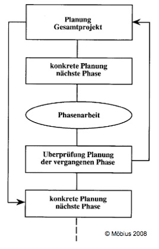
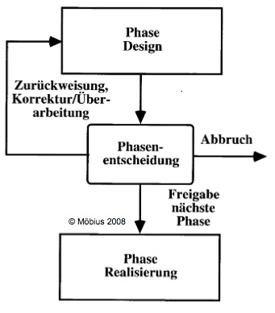

QPM Compilation
===============

[https://github.com/devfoo-one/QPM-Klausurvorbereitung](https://github.com/devfoo-one/QPM-Klausurvorbereitung)

Qualität
========

Was ist Qualität?
-----------------

> Qualität ist die Gesamtheit der **Eigenschaften** und **Merkmale** eines **Produkts** oder einer **Tätigkeit**, die sich auf deren Eignung zur Erfüllung gegebener Erfordernisse bezieht.

5 Ansätze um Qualität zu erklären:

1.	transzendentaler (übernatürlicher) Ansatz

	-	Qualität ist universell erkennbar, absolut, einzigartig und vollkommen.
	-	Qualität kann nicht exakt definiert oder gemessen werden.

2.	produktbezogener Ansatz

	-	Qualität ist eine messbare, genau spezifizierte Größe, die das Produkt beschreibt und durch die man Qualitätsunterschiede aufzeigen kann.
	-	Subjektive Beobachtungen und Wahrnehmungen werden nicht berücksichtigt.

3.	benutzerbezogener Ansatz

	-	Qualität wird durch den Produktbenutzer festgelegt.
	-	Benutzer entscheidet, ob es sich um ein Qualitätsprodukt handelt oder nicht
	-	da verschiedene Benutzer unterschiedliche Wünsche haben, werden diejenigen Produkte als qualitativ hochwertig angesehen, die die Bedürfnisse einer Vielzahl von Benutzern am besten befriedigen

4.	prozessbezogener Ansatz

	-	Qualität entsteht durch die richtige Erstellung des Produkts

5.	Kosten-/Nutzenbezogener Ansatz

	-	Qualität ist eine Funktion von Kosten und Nutzen
	-	Ein Qualitätsprodukt ist ein Erzeugnis, das einen bestimmten Nutzen zu einem akzeptablen Preis erbringt

Softwarequalität
----------------

DIN ISO 9126:

> Softwarequalität ist die Gesamtheit der **Merkmale** und **Merkmalswerte** eines Softwareprodukts, die sich auf die **Eignung** beziehen, festgelegte oder vorausgesetzte **Erfordernisse** zu erfüllen.

Sechs Qualitätsmerkmale werden allgemin unterschieden. Diese können auf jede Art von Software angewandt werden:

-	**Funktionalität**
	-	*Richtigkeit*
		-	liefert die richtigen oder vereinbarten Ergebnisse
	-	*Sicherheit*
		-	beabsichtigten oder unbeabsichtigten unberechtigten Zugriff verhindern
	-	...
-	**Zuverlässigkeit**
	-	*Reife*
		-	geringe Versagenshäufigkeit durch Fehlerzustände
	-	*Wiederherstellbarkeit*
		-	bei einem Versagen das Leistungsniveau wiederherstellen und die direkt betroffenen Daten wiedergewinnen
	-	...
-	**Benutzbarkeit**
	-	*Verständlichkeit*
		-	Aufwand für den Benutzer, das Konzept und die Anwendung zu verstehen
	-	*Erlernbarkeit*
		-	Aufwand für den Benutzer, die Anwendung zu erlernen
	-	...
-	**Effizienz**
	-	*Zeitverhalten*
		-	Antwort- und Verarbeitungszeiten sowie Durchsatz bei der Funktionsausführung
	-	*Verbrauchsverhalten*
		-	Anzahl und Dauer der benötigten Betriebsmittel (Ressourcen) für die Erfüllung der Funktionen
	-	...
-	**Änderbarkeit** (findet er wohl besonders interessant!)
	-	*Analysierbarkeit*
		-	Aufwand, um Mängel oder Ursachen von Versagen zu diagnostizieren
	-	*Modifizierbarkeit*
		-	Aufwand zur Ausführung von Verbesserungen, zur Fehlerbeseitigung oder Anpassung an Umgebungsänderungen
	-	*Prüfbarkeit*
		-	Aufwand, der zur Prüfung der geänderten Software notwendig ist
	-	...
-	**Übertragbarkeit**
	-	*Anpassbarkeit*
		-	Möglichkeiten, die Software an verschiedene, festgelegte Umgebungen anzupassen
	-	*Installierbarkeit*
		-	Aufwand, der zum Installieren der Software in einer festgelegten Umgebung notwendig ist
	-	...

Qualitätssicherungsmaßnahmen
----------------------------

***kommen lt. Klausurvorbereitung nicht dran, da wir diese in der VL nicht abgehandelt hatten***

### konstruktive Qualitätssicherung

### analytische Qualitätssicherung

Qualitätsmanagement
-------------------

> **Qualitätsmanagement** umfasst alle Tätigkeiten der Gesamtführungsaufgabe, welche die **Qualitätspolitik, Ziele und Verantwortungen festlegen** sowie diese durch Mittel wie Qualitätsplanung, Qualitätslenkung, Qualitätssicherung und Qualitätsverbesserung im Rahmen des Qualitätsmanagementsystems **verwirklichen** (DIN EN ISO 8402)

Qualitätssicherung
------------------

### Analytische Verfahren zur Qualitätssicherung

1.	Testende Verfahren (haben das **Ziel, Fehler zu erkennen.** )
	-	Dynamische Testverfahren
		-	Die Systemkomponente **wird ausgeführt** um Fehler zu finden.
	-	Statische Testverfahren
		-	Systemkomponente wird nicht ausgeführt, sondern **der Quellcode wird analysiert** um Fehler zu finden
2.	Verifizierende Verfahren (**beweisen die Korrektheit einer Systemkomponente** )
	-	Verifikation
		-	beweist mit mathematischen Mitteln die Konsistenz zwischen der Spezifikation und der Implementierung einer Systemkomponente
	-	Symbolische Ausführung
		-	Ein Quellprogramm wird mit allgemeinen symbolischen Eingabewerten durch einen Interpreter ausgeführt
3.	Analysierende Verfahren (**vermessen bestimmte Eigenschaften** von Systemkomponenten)
	-	Analyse der Bindungsart
		-	ein funktionales Modul soll funktional gebunden sein
		-	eine funktionale Bindung liegt vor, wenn alle Elemente des Moduls an der Verwirklichung einer einzigen, abgeschlossenen Funktion beteiligt sind
	-	Metriken
		-	Eigenschaften wie strukturelle Komplexität, Programmlänge, Grad der Kommentierung, ... quantitativ ermitteln und mit bisherigen Maßzahlen vergleichen
	-	Grafiken und Tabellen
		-	erlauben es ein Programm unter speziellen Gesichtspunkten zu analysieren und die Ergebnisse in gut lesbarer und interpretierbarer Form darzustellen

Dynamische Testverfahren
========================

Dynamische Testverfahren, bei denen Fehler in Systemkomponenten durch die Ausführung des entsprechenden Codes identifiziert werden, können noch weiter klassifiziert werden. Sie haben das Ziel **Fehler zu erkennen** mittels:

-	Zufallstests
-	Test spezieller Werte
-	Funktionale Äquivalenzklassenbildung
-	Grenzwertanalyse
-	Parallelalgorithmen

Allgemeines:

-	spezielle Werte des Datentyps berücksichtigen
	-	`0,1,2` bei int, sowie die negativen Werte
	-	`MAX_VALUE` und `MIN_VALUE`
-	Strings
	-	Übergabe von `null` testen
	-	Leerstring
	-	Strings mit nur einem Zeichen
	-	Strings mit einem Steuerzeichen, z.B. `\n`
	-	sehr lange Strings

Äquivalenzklasse und Grenzwertanalyse
-------------------------------------

Die *Definitionsbereiche der Eingabeparameter* und die *Wertebereiche der Ausgabeparameter* werden in **Äquivalenzklassen** zerlegt.

-	Es wird davon ausgegangen, dass ein Programm bei der **Verarbeitung eines Repräsentanten aus einer Äquivalenzklasse so reagiert wie bei allen anderen Werten aus dieser Klasse.**
-	Wenn das Programm mit dem **repräsentativen Wert aus der Äquivalenzklasse** fehlerfrei läuft, dann ist zu erwarten, dass es auch für andere Werte aus dieser Klasse **korrekt funktioniert.**

Testfälle die die **Grenzwerte der Äquivalenzklassen abdecken** oder in unmittelbarer Umgebung dieser Grenzen liegen, sind besonders effektiv und decken besonders häufig Fehler auf.

Modultest
---------

-	untersuchen stets einen **möglichst kleinen, für sich allein funktionierenden Code-Ausschnitt**, etwa eine einzelne Methode oder Klasse
-	Entwickler können hier bereits preiswert Detailfehler aufdecken und beseitigen bevor die Testabteilung oder der Kunde darauf stößt
-	Stichwort **Test Driven Design, Test First**
-	Das Schreiben von Modultests setzt ein hohes Verständnis guten Softwaredesigns voraus.

Parallelalgorithmen
-------------------

Ist ein **alternativer Algorithmus** mit den (zumindest theoretisch erwarteten) identischen Ergebnissen. Er dient zum parallelen Vergleich des zu testenden Algorithmus.

Black-Box Tests
---------------

Black-Box-Tests (auch **funktionale Tests** genannt) verwenden nur die **offengelegten Schnittstellen** eines Testmoduls um dieses mit Eingaben zu versorgen und das Ergebnis auszuwerten. Syntax und Semantik des der implementierten Methode zugrundeliegenden Algorithmus wird nicht interpretiert.

Glass-Box-Tests
---------------

Wie Black-Box-Tests, nur mit zusätzlicher Kenntnis des Quellcodes.

weitere Testverfahren
---------------------

-	GUI Tests
-	Inhalts- und Pixelvergleich

Softwaremetriken
================

Projektmanagement
=================

Projektmanagement ist aus der Sicht der Organisationslehre eine **Koordinationsmethode**.

Was ist ein Projekt?
--------------------

-	Es ist eine **einmalige** Aufgabe.
-	Es ist eine **komplexe** Aufgabe.
-	Es ist **terminlich befristet**.
-	Es wird von mehreren **Personen, Arbeitsgruppen, Gremien** durchgeführt.

Aber eine Aufgabe kann auch ein Projekt sein wenn nicht sämtliche Punkte der Definition zutreffen.

### Projektunterscheidungen

-	**Art**
	-	Entwicklungsprojekt
	-	Weiterentwicklung
	-	Wartung
	-	Änderungsprojekt
	-	Evaluierungsprojekt
	-	Rollout / Deployment
-	**Größe**
	-	kleines Projekt (> 20 PT , < 100 PT)
	-	mittelgroßes Projekt (> 100 PT , < 200 PT)
	-	großes Projekt (> 200 PT)

Begriffe
--------

### Projektleitung

Bei der Projektleitung handelt es sich um die **verantwortliche Leitung** eines Proekts, wobei in der überwiegenden Anzahl der Fälle der Projektleiter **nicht die Kompetenzen eines Disziplinarvorgesetzten** hat. Projektleitung ist **häufig nur eine temporäre Aufgabe**

### Projektmanagement

Der Begriff Projektmanagement wird dann verwendet, wenn es sich um die **Verantwortung für mehrere Projekte** handelt, oder wenn der Projektleiter **auch die Funktion eines Disziplinarvorgesetzten** hat.

> Projektmanagement ist die Gesamtheit von Führungsaufgaben, -organisation, -techniken und -mittel für die Abwicklung eines Projekts.

Aufgaben des Projektmanagements
-------------------------------

### Aufgaben und Ziele

-	Sicherstellen dass **Projektziele** und **Projektaufgaben** klar definiert sind.
-	**Notwendigkeit**, Bedeutung und Sinn des Projekts sicherstellen

### Organisation und Kompetenzen

-	Eindeutige **Projektleitung** und **Projektorganisation** festlegen
-	Projektleitung und -organisation zweckmäßig in die **Struktur des Unternehmens einbetten**
-	**Kompetenzen** klar regeln. **Überschneidungen** vermeiden

### Akzeptanz und Identifikation

-	Sicherstellen, dass das Projekt von allen Beteiligten (spätere Anwender, Entwickler) **akzeptiert wird** und diese sich mit dem Proekt identifizieren
-	**Marketing** für das Projekt machen
-	die späteren Anwender in den Entwicklungsprozess **einbeziehen**
-	**"Kollektive Verantwortung"** herstellen
-	Kommunikationsbeziehungen vom Proekt **zum Anwender** herstellen
-	**Angst** vor Neuerungen nehmen
-	Starke politische Einflüsse **wahrnehmen**

### Projektinterne Faktoren

-	**Erfahrene Projektleiter** verwenden
-	**Realistische Projektplanung** vornehmen
-	die späteren Anwender in den Entwicklungsprozess **einbeziehen**
-	**Mehrfachbelastung** des Projektleiters und der Mitarbeiter vermeiden.
-	**Konflikte** erkennen und beseitigen
-	**Überforderungen** erkennen und beseitigen

Probleme des Projektmanagements
-------------------------------

-	unrealistische **Zeitschiene**
-	externe **Einflüsse**
-	Fehleinschätzung von **Projektrisiken**
-	unrealistische **Ressourcenplanung**
-	unternehmensinterne **Widerstände**
-	personelle **Fehlbesetzung**
-	unklare **Zieldefinition**

Prinzip der fortschreitenden Verfeinerung
-----------------------------------------

Zunächst wird das **gesamte Projekt geplant**. Da hier jedoch viele Einzelheiten noch nicht sichtbar sind und keine stimmende Planung möglich ist wird das Projekt in **Phasen aufgeteilt** und innerhalb dieser inhaltlich verfeinert. Bei Abschluss einer Phase wird die ursprüngliche Phasenplanung, sowie die Gesamtprojektplanung überprüft.

### Phasenentscheidung

Am Ende jeder Phase steht die Phasenentscheidung, die auf den bisher erarbeiteten (inhaltlichen) Ergebnissen und den korrigierten / angepassten Werten der Projektplanung basiert.

Sie kann drei Alternativ-Richtungen verfolgen:

-	**Freigabe** der nächsten Phase
-	**Zurückweisung** dieser Phase
-	**Projektabbruch**

Phasenentscheidungen bedeuten teilweise erheblichen **zeitlichen Aufwand**. Auch wenn dieser Aufwand, je nach Vereinbarung, nicht budget-relevant ist, sollte er dennoch **terminlich berücksichtigt** werden.
